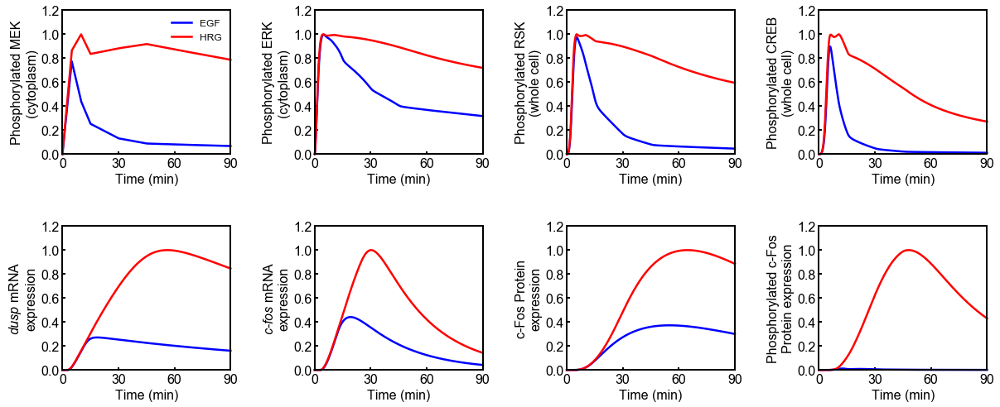

# Nakakuki2010
Nakakuki, T. *et al.* Ligand-specific c-Fos expression emerges from the spatiotemporal control of ErbB network dynamics. *Cell* **141**, 884–896 (2010). https://doi.org/10.1016/j.cell.2010.03.054

## Requirements
- **[Python3+](https://www.python.org)**
    - numpy
    - scipy
    - matplotlib
    - jupyter

## Run Simulation and View Results
```python
%matplotlib inline
from run_sim import run_simulation
run_simulation()
```


## Installation
    $ git clone https://github.com/okadalabipr/Nakakuki2010.git

## License
[MIT](/LICENSE)